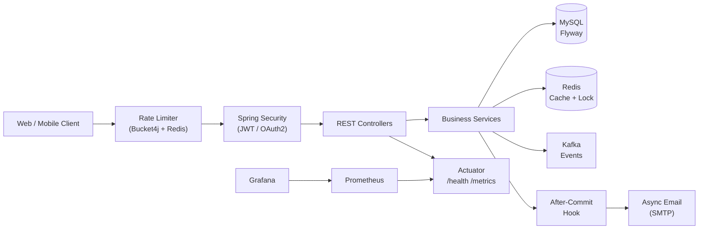
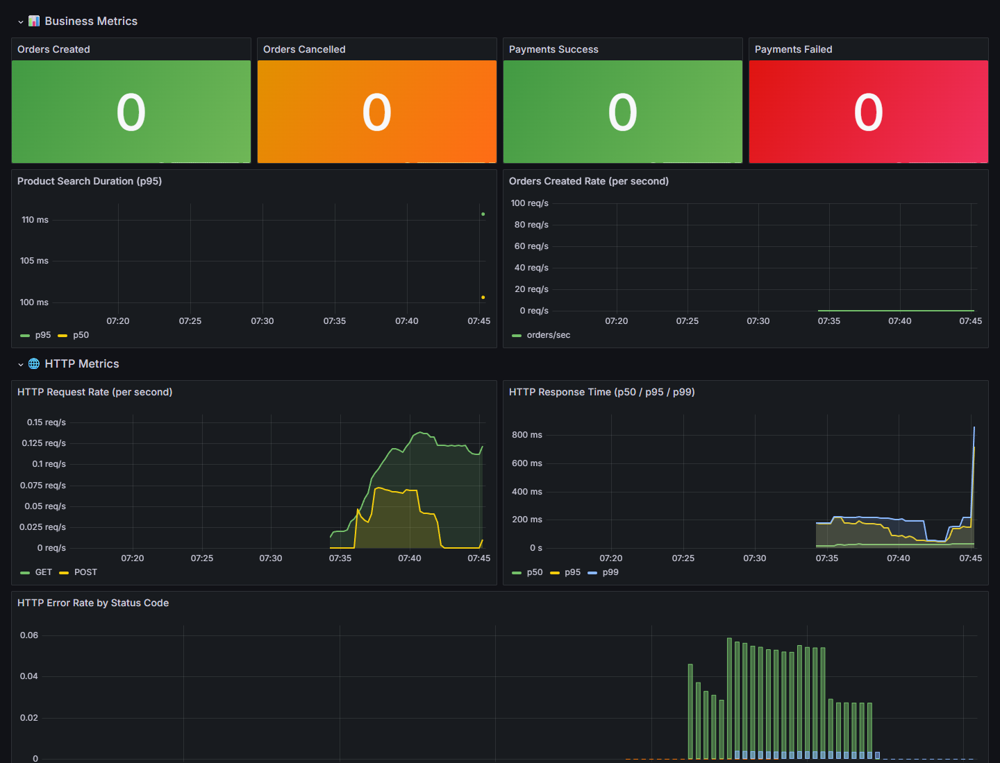

# Ecom BE

[](https://github.com/manhtw0ne/ecom_be/actions/workflows/ci.yml)
[](https://openjdk.org/projects/jdk/21/)
[](https://spring.io/projects/spring-boot)
[](https://opensource.org/licenses/MIT)

Production-ready e-commerce REST API built with **Java 21** and **Spring Boot 3.3.5**.

> **Live Demo:** [https://ecom-be.onrender.com/swagger-ui.html](https://ecom-be.onrender.com/swagger-ui.html) *(may take 30s to wake up on free tier)*

---

## Tech Stack

| Layer | Technology |
|---|---|
| Language | Java 21 (LTS) |
| Framework | Spring Boot 3.3.5 |
| Security | Spring Security, JWT, OAuth2 (Google, Facebook) |
| Database | MySQL 8 + Flyway migrations |
| Cache | Redis + Redisson (distributed lock) |
| Messaging | Apache Kafka |
| Monitoring | Prometheus + Grafana |
| Rate Limiting | Bucket4j (Redis-backed) |
| Payment | VNPay integration |
| Documentation | SpringDoc OpenAPI 3 (Swagger UI) |
| Containerization | Docker + Docker Compose |

---

## Architecture



---

## Features

- **Authentication:** JWT login + Google/Facebook OAuth2 — access and refresh token flow
- **Products:** CRUD, image upload, Redis caching (TTL 5 min), category filter, keyword search
- **Orders:** Full lifecycle (PENDING → PROCESSING → SHIPPED → DELIVERED), cancel with stock restore
- **Inventory:** Stock tracking with pessimistic lock + Redisson distributed lock (anti-overselling)
- **Payment:** VNPay integration with sandbox support
- **Rate Limiting:** 10 req/min for login/register (brute-force guard), 60 req/min for public APIs
- **Monitoring:** Custom business metrics, Prometheus endpoint, pre-built Grafana dashboard
- **Email:** Async order confirmation via dedicated thread pool, isolated from transaction
- **Security:** CORS, security headers, BCrypt passwords, JWT validation filter chain

---

## Quick Start (Docker — recommended)

Requires Docker Desktop.

```bash
git clone https://github.com/manhtw0ne/ecom_be
cd ecom_be
docker compose up -d --build --wait
```

| Service | URL |
|---|---|
| API Base | http://localhost:8080/api/v1 |
| **Swagger UI** | **http://localhost:8080/swagger-ui.html** |
| Health | http://localhost:8080/api/v1/actuator/health |
| Grafana | http://localhost:3000 (admin / local-grafana-password) |
| Prometheus | http://localhost:9090 |

> Flyway runs migrations automatically on startup. No manual SQL import needed.

---

## Local Development (without Docker)

```bash
# 1. Start infrastructure (MySQL, Redis, Kafka)
docker compose -f docker-compose-infra.yml up -d

# 2. Run the application in dev mode
./mvnw spring-boot:run

# Or use the helper script (Windows PowerShell)
pwsh -File scripts/dev.ps1 run
```

Default dev database: `jdbc:mysql://localhost:3306/ecom_db` (root/root).  
Override with `DB_URL`, `DB_USERNAME`, `DB_PASSWORD` environment variables.

---

## API Overview

Explore the full API at **Swagger UI** after starting the app. Key endpoints:

```
POST   /api/v1/users/register    Register new user
POST   /api/v1/users/login       Login → returns JWT token

GET    /api/v1/products          List products (paginated, cached)
GET    /api/v1/products/{id}     Product detail
POST   /api/v1/products          Create product (ADMIN)
PUT    /api/v1/products/{id}     Update product (ADMIN)

POST   /api/v1/orders            Place order (requires JWT)
GET    /api/v1/orders/{id}       Order detail
PUT    /api/v1/orders/{id}       Update order status (ADMIN)
DELETE /api/v1/orders/{id}       Cancel order

GET    /api/v1/categories        List categories
POST   /api/v1/categories        Create category (ADMIN)
```

### Quick API test with curl

```bash
# Register
curl -X POST http://localhost:8080/api/v1/users/register \
  -H "Content-Type: application/json" \
  -d '{"email":"user@example.com","password":"Password1!","retype_password":"Password1!","role_id":1}'

# Login
curl -X POST http://localhost:8080/api/v1/users/login \
  -H "Content-Type: application/json" \
  -d '{"email":"user@example.com","password":"Password1!","role_id":1}'

# List products (public)
curl http://localhost:8080/api/v1/products?page=0&limit=10
```

---

## Testing

```bash
# Unit/HTTP tests (H2; no external services required)
./mvnw test

# Tests + JaCoCo coverage report (minimum 70% enforced)
./mvnw verify

# Integration tests (requires MySQL + Redis via Docker)
docker compose -f docker-compose.test.yml up -d --wait
./mvnw verify -Pintegration
docker compose -f docker-compose.test.yml down -v
```

Coverage report after `verify`: `target/site/jacoco/index.html`

---

## Dashboard



---

## Configuration

Copy `.env.example` to `.env` and adjust values for local development.  
Production requires at minimum: `DB_URL`, `DB_USERNAME`, `DB_PASSWORD`, `JWT_SECRET`.

See `docs/architecture/` for detailed design decisions.

---

## License

MIT License — see [LICENSE](LICENSE) for details.